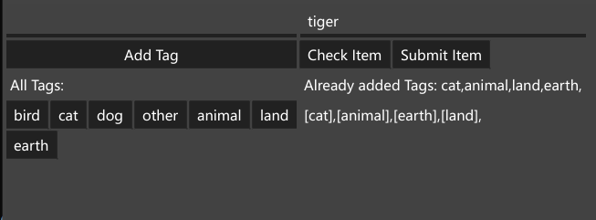

Generally, for Some project contents makers, especially for some starupers, they don't have database skill. This is for them to collect base data before producing begin. It's very easy to use for adding, checking, updating.

Using sqlite local file, we got more faster speed than normal file like json or xml. And it is very easy to migrate to production seed data. It also support huge amount data.

### Features
- GUI
- pure golang
- all platform: linux, macos, windows
- simple to build and use
- support huge amount data

### Stack
- golang
- fyne
- xorm

### How to use
1. clone this project to folder
2. ```cd``` to this folder
3. ```go build && add-tags-app```

### Screensnap:
